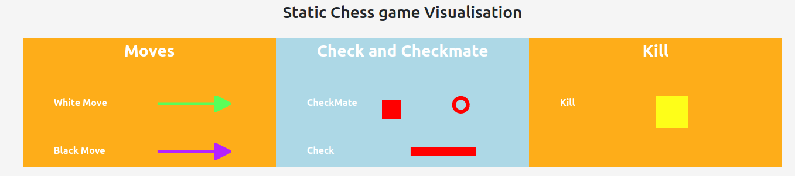
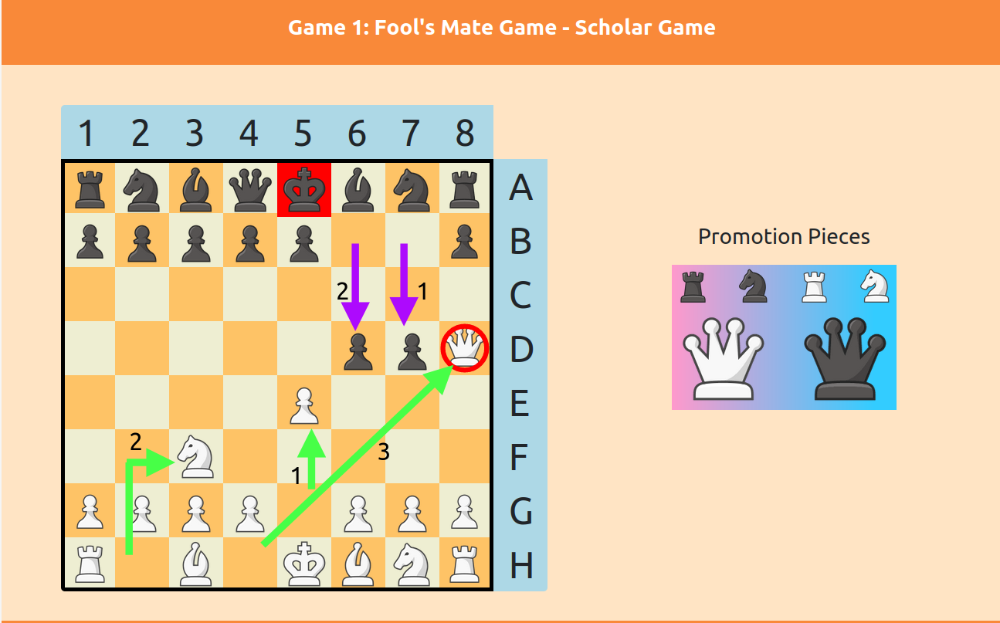
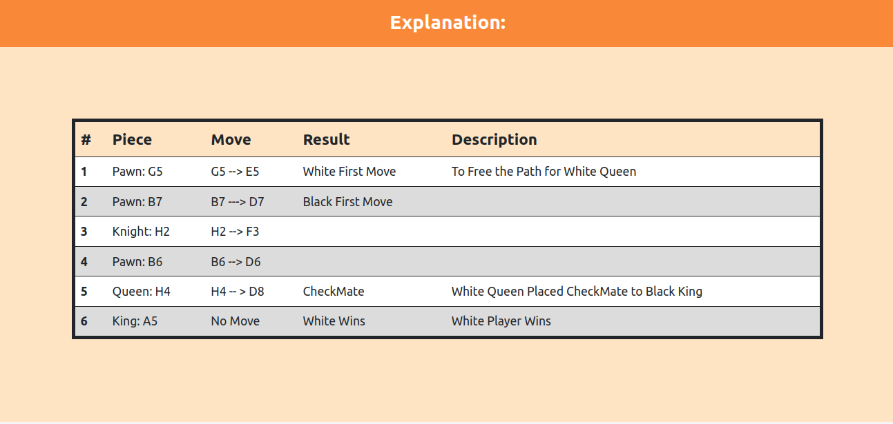
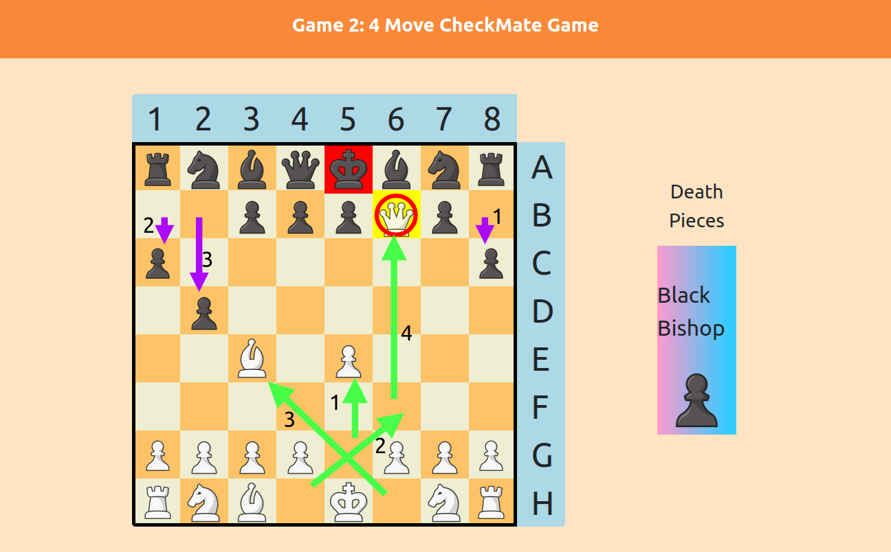
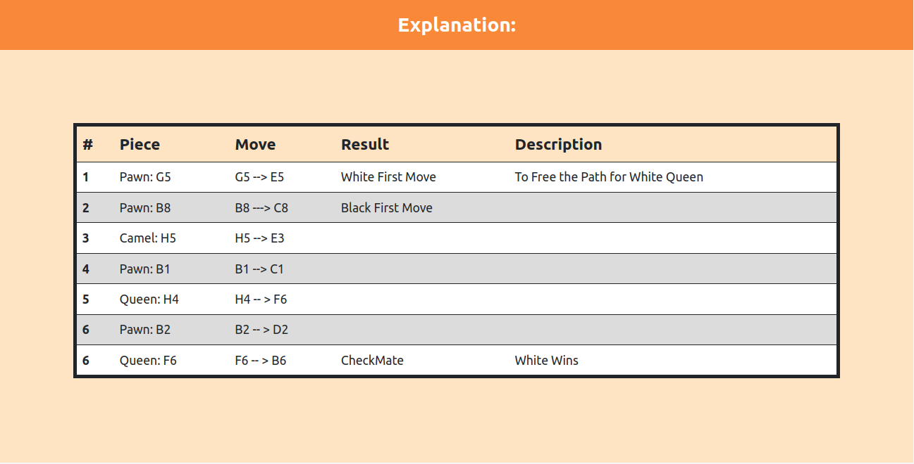
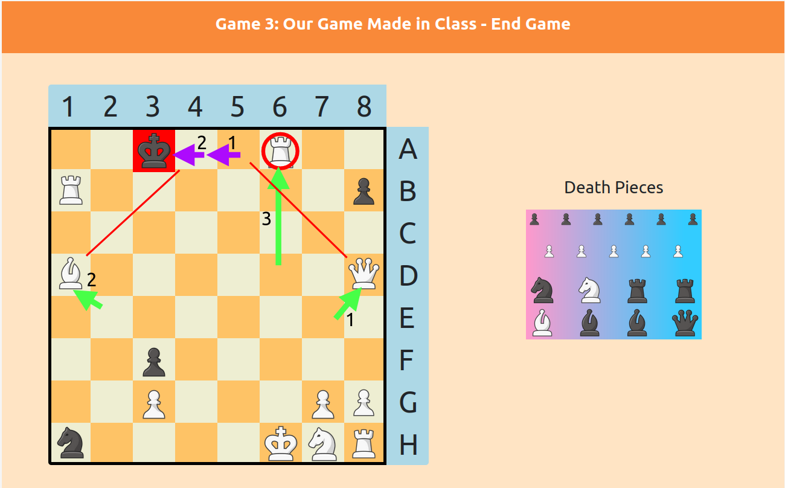
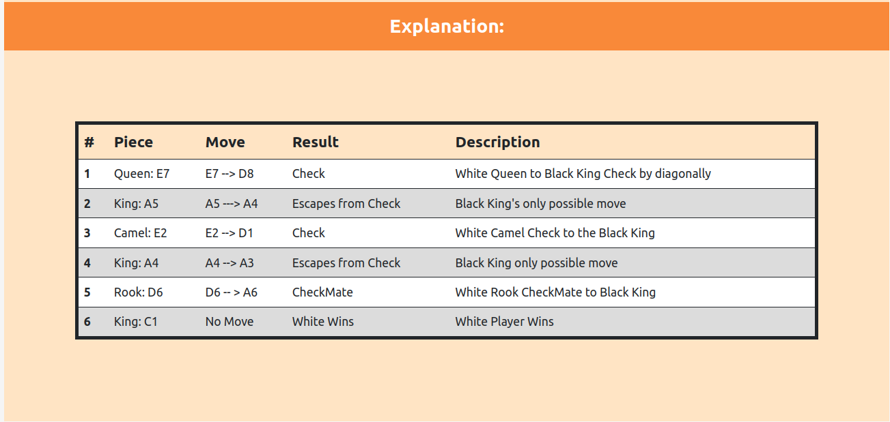

# Static_Chess_Game_Visualisation

### Link to the website:

```
https://static-chess-visualisation.netlify.app/
```

## Visualisations: 
### Legend 


--- 

### Game 1



---

### Game 2



---

### Game 3



### Contribution or Run Locally: 
1. Clone the Repository
2. cd into the folder
3. Run
   ```
     python3 -m http.server
   ```
4. Open the link given in the terminal

Note: Open with only live server, Local server will not work properly. 
